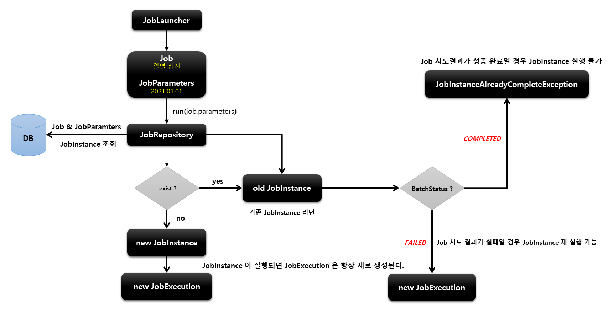
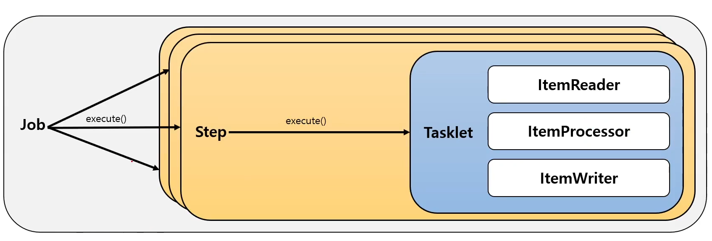
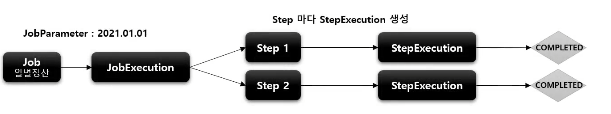
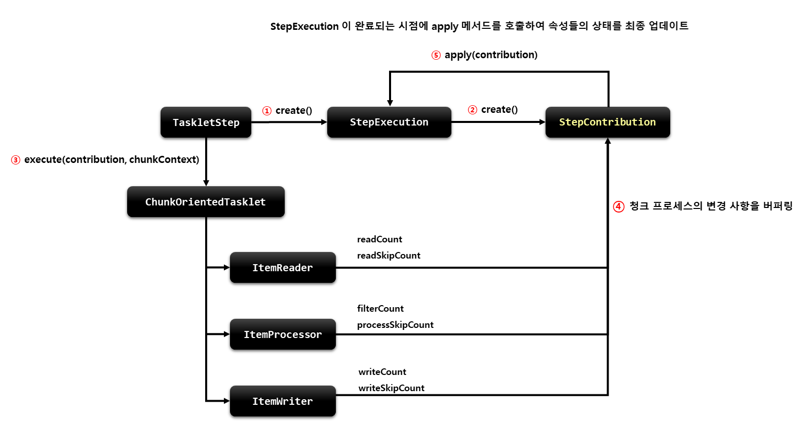
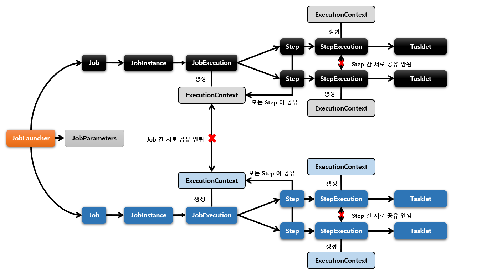
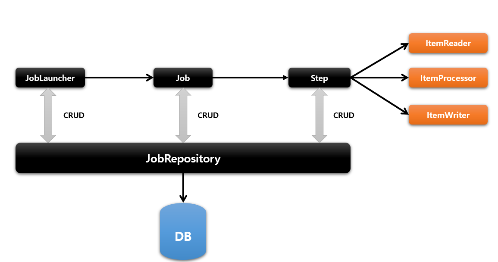
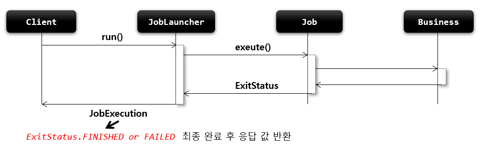
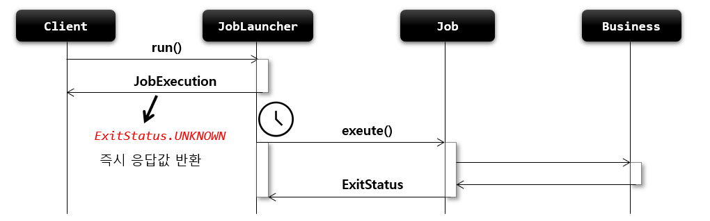

## Job, Step, Tasklet

---
```
job 이 구동되면 Step 을 실행하고 Step 이 구동되면 Tasklet 을 실행하도록 설정
```
`job` > start(helloStep) > `Step` > tasklet() > `Tasklet`

### Job
- 일
- 일감

### Step
- 일의 항목
- 일의 단계

### Tasklet
- 작업 내용


## Job

---

### 기본개념
 - 배치 계층 구조에서 가장 상위에 있는 개념으로서 하나의 배치작업 자체를 의미함
   - ex : API 서버의 접속 로그 데이터를 통계 서버로 옮기는 배치 인 Job 자체를 의미
 - Job Configuration 을 통해 생성되는 객체 단위로서 배치작업을 어떻게 구성하고 실행할 것인지 전체적으로 설정하고 명세
 - 배치 Job을 구성하기 위한 최상위 인터페이스며 스프링 배치가 기본 구현체를 제공
 - 여러 Step을 폼하하고 있는 컨테이너로서 반드시 한개 이상의 Step으로 구성해야 함

### 기본 구현체
 - **SimpleJob**
   - 순차적으로 Step 을 실행시키는 Job
   - 모든 Job에서 유용하게 사용할 수 있는 표준 기능을 갖고 있음


 - **FlowJob**
   - `특정한 조건과 흐름`에 따라 Step 을 구성하여 실행시키는 Job
   - Flow 객체를 실행시켜 작업을 진행함
 
## JobInstance

### 기본개념
 - Job이 실행될 때 생성되는 Job의 논리적 실행 단위 객체로서 `고유하게 식별 가능한 작업` 실행
 - Job의 설정과 구성은 동일하지만 Job이 실행되는 시점에 처리하는 내용은 다르기 때문에 `Job의 실행을 구분`해야 함
   - ex : 하루에 한 번 씩 배치 Job이 실행된다면 매일 실행되는 각각의 Job 을 JobInstance로 표현
 - JobInstance 생성 및 실행
   - 처음 시작하는 Job + JobParameter 일 경우 새로운 JobInstance 생성
   - 이전과 동일한 Job + JobParameter 으로 실행 할 경우 이미 존재하는 JobInstance 리턴
     - 내부적으로 JobName + JobKey ( 해시값 ) 를 가지고 JobInstance 객체를 얻음
   - Job과는 1:M 관계

### BATCH_JOB_INSANCE 테이블과 맵핑
 - JOB_NAME(Job) 과 JOB_KEY( 파라미터 해시 값 ) 가 동일한 데이터는 중복해서 저장 할 수 없음
  > 최초 Job 호출 시, 동일한 데이터의 호출이 이뤄질 경우 수행 되지 않음
 

## JobParameter

### 기본개념
 - Job을 실행할 때 함께 포함되어 사용되는 파라미터를 가진 도메인 객체
 - 하나의 Job에 존재할 수 있는 여러개의 `JobInstance를 구분하기 위한 용도`
 - JobParameters와 JobInstance는 1:1 관계

### 생성 및 바인딩
 - 어플리케이션 실행 시 주입
   - Java -jar Batch.jar requestData = 20210101
 - 코드로 생성
   - JobParameterBuilder, DefaultJobParametersConverter
 - SpEL 이용
   - @Value("`#{JobParameter[requestDate]}`"), `@JobScope`, `@StepScope` 선언 필수

### BATCH_JOB_EXECUTION_PARAMS 테이블과 맵핑
 - JOB_EXECUTION 과 1:M의 관계

## JobExecution

### 기본개념
 - JobInstance 에 대한 한번의 시도를 의미하는 객체로서 Job 실행 중에 발생한 정보들을 저장하고 있는 객체
   - `시작시간`, `종료시간`, `상태`(시작됨, 완료, 실패), `종료상태`의 속성을 가짐


 - JobInstance 와 관계
   - JobExecution 은 `FAILED` 또는 `COMPLETED` 등의 Job 의 실행 결과 상태를 가지고 있음
   - JobExecution 의 실행 상태 결과가 `COMPLETED` 면 JobInstance 실행이 완료 된 것으로 간주해서 `재실행 불가`
   - JobExecution 의 실행 상태 결과가 `FAILED`면 JobInstance 실행이 완료되지 않은 것으로 간주해서 `재실행 가능`
     - JobParameter 가 동일한 값으로 Job을 실행할지라도 JobInstance를 계속 실행할 수 있음
   - JobExecution 의 실행 상태 결과가 `COMPLETED`될 때까지 하나의 JobInstance 내에서 여러 번의 시도가 생길 수 있음
 
### BATCH_JOB_EXECUTION
 - JobInstance 와 JobExecution 는 1:M 의 관계로서 JobInstance 에 대한 `성공`, `실패`의 **내역을 가지고 있음**



## Step

### 기본개념
 - Job을 구성하는 독립적인 하나의 단계로서 실제 배치 처리를 정의하고 컨트롤하는데 필요한 모든 정보를 가지고 있는 도메인 객체
 - 단일 Task 뿐 아니라 `입력`, `처리`, `출력`과 관련된 복잡한 비즈니스 로직을 포함하는 모든 설정을 담고 있음
 - 모든 Job은 하나 이상의 Step 으로 구성

### 기본 구현체
 - **TaskletStep**
   - 가장 기본이 되는 클래스로 Tasklet 타입의 구현체들을 제어
 - **PartitionStep**
   - `멀티 쓰레드 방식`으로 Step 을 여러 개로 분리해서 실행
 - **JobStep**
   - Step 내에서 Job 을 실행
 - **FlowStep**
   - Step 내에서 Flow 를 실행
 


### API 설정에 따른 각 Step

 - `TaskletStep` 직접 생성한 Tasklet 실행
```java
public Step taskletStep(){
    return stepBuilderFactory.get("step")
            .tasklet(CustomTasklet())
            .build();
}
```
 - `TaskletStep` - **ChunkOrientedTasklet** 실행
```java
public Step taskletStep() {
    return stepBuilderFactory.get("step")
            .<Person, Person>chunk(100)
            .reader(reader())
            .writer(writer())
            .build();
}
```
 - Step 에서 Job 실행
```java
public Step taskletStep() {
    return stepBuilderFactory.get("step")
            .job(job())
            .launcher(jobLauncher)
            .parametersExtractor(jobParameterExtractor())
            .build();
}
```

## StepExecution

### 기본 개념
 - Step 에 대한 한번의 시도를 의미하는 객체로서 Step 실행 중에 발생한 정보들을 저장하고 있는 객체
   - **시작시간**, **종료시간**, **상태**(시작,완료,실패), **commit count**, **rollback count** 등의 속성을 가짐
 - Step 이 매번 시도될 때마다 생성되며, 각 Step 별로 생성
 - `Job 이 재시작` 하더라도 이미 성공된 Step 은 재실행 X, `실패한 Step 만 실행` ( 옵션을 통해 성공한 Step 도 실행 시킬 수 있음 )
 - Step 이 실제로 시작됐을 때만 StepExecution 생성됨
 - JobExecution 과의 관계
   - Step 의 StepExecution 이 모두 정상적으로 완료 되어야 JobExecution 도 정상적으로 완료
   - Step 의 StepExecution 중 하나라도 실패 시, JobExecution 은 실패처리



### BATCH_STEP_EXECUTION 테이블과 맵핑
 - JobExecution 과 StepExecution 은 `1:M` 의 관계
 - 하나의 Job에 여러 개의 Step 으로 구성했을 경우 각 StepExecution 은 하나의 JobExecution 을 부모로 가진다


## StepContribution

### 기본개념
 - 청크 프로세스의 변경 사항을 버퍼링 한 후 StepExecution 상태를 업데이트하는 도메인 객체
 - 청크 커밋 직전에 StepExecution 의 apply 메서드를 호출하여 상태를 업데이트
 - ExitStatus(종료코드) 외 `사용자 정의 종료코드`를 적용 할 수 있음




## ExecutionContext

### 기본개념
 - 프레임워크에서 유지 및 관리하는 키/값으로 된 컬렉션 StepExecution 또는 JobExecution 객체의 **상태**를 저장하는 공유객체
 - DB에 직렬화 된 값으로 저장됨
 - 공유 범위
   - Step - 각 Step 의 StepExecution 에 저장되며 `Step 간 서로 공유X`
   - Job - 각 Job의 JobExecution 에 저장되며 `Job 간 서로 공유X, 해당 Job 의 Step 간 서로 공유`
 - Job 재 시작시 이미 처리한 Row 데이터는 건너뛰고 이후로 수행하도록 할 때 상태 정보를 활용

```java
Map<String, Object> map = new ConcurrentHashMap<>();
```



## JobRepository

### 기본개념
 - 배치 작업 중의 정보를 저장하는 저장소
 - 배치 작업의 수행과 관련된 모든 **meta data** 를 저장함
   - JobLauncher, Job, Step 구현체 내부에서 CRUD 기능 처리

 
 
### JobRepository 설정
 - `@EnableBatchProcessing` 어노테이션 선언 시, `JobRepository 자동 생성`
 - BatchConfigurer 인터페이스를 구현하거나 BasicBatchConfigurer 를 상속해서 JobRepository 설정을 커스터마이징 할 수 있음
   - JDBC 방식 - **JobRepositoryFactoryBean**
     - 내부적으로 AOP 기술을 통해 트랜잭션 처리
     - 트랜잭션 isolation 기본값은 **SERIALIZEBLE**(최고수준), 다른레벨 지정가능
     - 메타테이블의 Table Prefix 를 변경할 수 있음, 기본 값은 `BATCH_`
   - In Memory 방식
     - Test 나 프로토타입 개발 시 사용

## JobLauncher

### 기본개념
 - 배치 Job 을 실행시키는 역할
 - Job 과 Job Parameters 를 인자로 받으며 요청된 배치 작업을 수행한 후 최종 client 에게 JobExecution을 반환
 - 스프링 부트 배치가 구동이 되면 JobLauncher Bean 자동생성 됨


 - Job 실행
   - JobLauncher.run(Job, JobParameters)
   - 스프링 부트 배치에서는 JobLauncherApplicationRunner 가 자동적으로 JobLauncher 을 실행
   - **동기적 실행**
     - taskExecutor 를 SyncTaskExecutor ( 기본값은 SyncTaskExecutor )
     - JobExecution 을 획득하고 배치 처리를 최종 완료한 이후 Client 에게 JobExecution 을 반환
     - **스케줄러**에 의한 배치처리에 적합
   
   - **비동기적 실행**
     - taskExecutor 가 SimpleAsyncTaskExecutor
     - JobExecution 을 획득한 후 Client 에게 바로 JobExecution 을 반환하고 배치처리
     - **HTTP 요청**에 의한 배치 처리에 적합
     