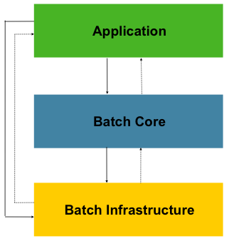

# Spring batch

---

### 스프링 배치 탄생 배경
 - 자바 기반 표준 배치 기술 부재
 - 재사용 가능한 자바 기반 배치 아키텍처 표준의 필요성

### 배치 핵심 패턴
 - **Read** - 데이터베이스, File, 큐에서 다량의 데이터를 조회
 - **Process** - 특정 방법으로 데이터를 가공한다
 - **Write** - 데이터를 수정된 양식으로 다시 저장한다.

```
DB의 ETL 용어와 비슷
```

### 배치 시나리오
 - 배치 프로세스를 `주기적으로 커밋`
 - 동시 다발적인 Job 의 배치 처리, `대용량 병렬 처리`
 - 실패 후 수동 또는 `스케줄링`에 의한 재시작
 - 의존관계가 있는 `Step` 여러 개를 순차적으로 처리
 - 조건적 Flow 구성을 통한 `체계적이고 유연`한 배치 모델
 - 반복, 재시도, Skip 처리

### 아키텍처



출처 : https://docs.spring.io/spring-batch/docs/4.3.x/reference/html/images/spring-batch-layers.png

#### Application
 - 스프링 배치 프레임워크를 통해 개발자가 만든 모든 배치 Job과 커스텀 코드를 포함
 - 개발자는 업무로직의 구현에만 집중, 공통적인 기반기술은 프레임워크가 담당

#### Batch Core
 - Job을 실행, 모니터링, 관리하는 API로 구성
 - JobLauncher, Job, Step, Flow 등이 속함

#### Batch Infrastructure
 - Application, Batch Core 빌드됨
 - Job 실행의 흐름과 처리를 위한 틀을 제공
 - Reader, Processor, Writer, Skip, Retry 등


# 스프링 배치 설정 Class ( ver 4.x 기준 )

---

1. **SimplebatchConfiguration**
    - JobBuilderFactory 와 StepBuilderFactory 생성
    - 스프링 배치의 주요 구성요소 생성 - 프록시 객체로 생성됨


2. **BatchAutoConfiguration** 
    - Job을 수행하는 JobLauncherApplicationRunner 빈을 생성


3. **BatchConfigurerConfiguration**
    - BasicBatchConfigurer
      - SimplebatchConfiguration 에서 생성한 프록시 객체의 실제 대상 객체를 생성
      - Bean으로 의존성 주입 받아서 주요 객체들을 참조해서 사용 할 수 있음
    - JpaBatchConfigurer
      - JPA 관련 객체를 생성하는 설정 클래스
    - `사용자 정의 BatchConfigurer 인터페이스를 구현하여 사용 할 수 있음`

