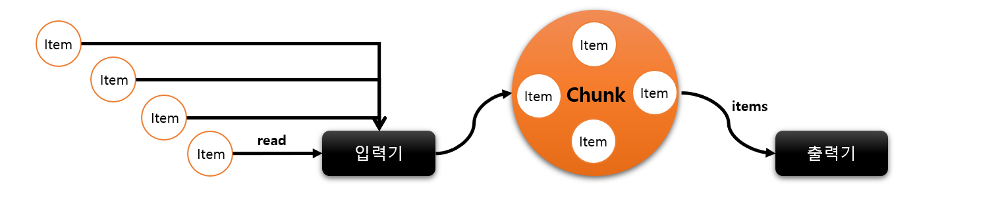
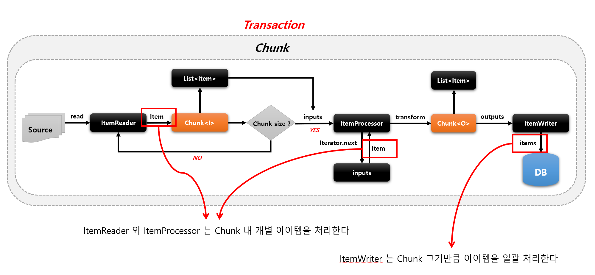
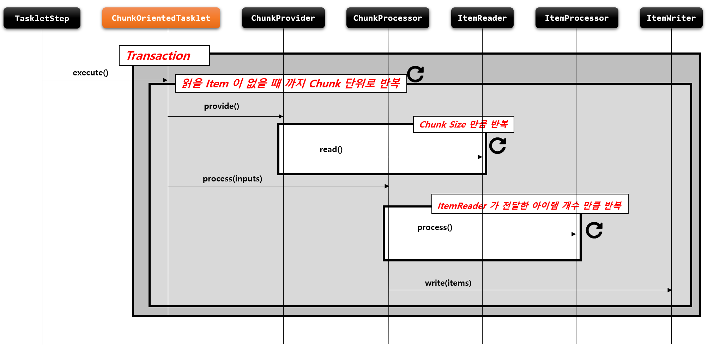

# Chunk

## 기본 개념

- Chunk 란 여려 개의 아이템을 묶은 하나의 덩어리 블록을 의미
- 한번에 하나씩 아이템을 입력 받아 Chunk 단위의 덩어리로 만든 후 Chunk 단위로 트랜잭션을 처리함, 즉 Chunk 단위의 Commit 과 Rollback 이 이루어짐
- 일반적으로 대용량 데이터를 한번에 처리하는 것이 아닌 청크 단위로 쪼개어서 더 이상 처리할 데이터가 없을 때까지 반복해서 입출력하는데 사용됨







# ChunkOrientedTasklet


```java
public Step chunkStep() {
    return stepBuilderFactory.get("chunkStep") 
    .<I, O>chunk(10)                    // Chunk size 설정, commit interval 을 의미, input, output, 제네릭타입 설정
    .<I, O>chunk(CompletionPolicy)      // Chunk 프로세스를 완료하기 위한 정책 설정 클래스
    .reader(itemReader())               // 소스로 부터 item 을 읽거나 가져오는 ItemReader 구현체
    .writer(itemWriter())               // item 을 목적지에 쓰거나 보내기 위한 ItemWriter 구현체
    .processor(itemProcessor())         // item을 변형, 가공, 필터링 하기 위한 ItemProcessor 구현체 ( optional )
    .stream(ItemStream())               // 재시작 데이터를 관리하는 콜백에 대한 스트림 등록
    .readerIsTransactionalQueue()       // Item 이 JMS, Message Queue Server 와 같은 트랜잭션 외부에서 읽혀지고 캐시할 것인지 여부, 기본값 false
    .listener(ChunkListener)            // Chunk 프로세스가 진행되는 특정 시점에 콜백 제공받도록 ChunkListener 설정
    .build();
    }

```

# ChunkProvider

## 기본개념

- ItemReader 를 사용해서 소스로부터 아이템을 Chunk size 만큼 읽어서 Chunk 단위로 만들어 제공하는 도메인 객체
- Chunk<I> 를 만들고 내부적으로 반복문을 사용해서 ItemReader.read() 를 계속 호출하면서 item 을 Chunk 에 쌓는다
- 외부로 부터 ChunkProvider 가 호출될 때마다 항상 새로운 Chunk 가 생성된다
- 반복문 종료 시점
  - Chunk size 만큼 item 을 읽으면 반복문 종료되고 ChunkProcessor 로 넘어감
  - ItemReader 가 읽은 item 이 null 일 경우 반복문 종료 및 해당 Step 반복문까지 종료
- 기본 구현체로서 SimpleChunkProvider 와 FaultTolerantChunkProvider 가 있다


# ChunkProcessor

## 기본개념

- ItemProcessor 를 사용해서 Item 을 변형, 가공, 필터링하고 ItemWriter 를 사용해서 Chunk 데이터를 저장, 출력한다
- Chunk<O>를 만들고 앞에서 넘어온 Chunk<I> 의 item 을 한 건씩 처리한 후 Chunk<O> 에 저장한다
- 외부로 부터 ChunkProcessor 가 호출될 때마다 항상 새로운 Chunk 가 생성된다
- ItemProcessor 는 설정 시 선택사항으로 만약 객체가 존재하지 않을 경우 ItemReader 에서 읽은 Item 그대로가 Chunk<O> 에 저장된다
- ItemProcessor 처리가 완료되면 Chunk<O> 에 있는 List<Item> 을 ItemWriter 에게 전달한다
- ItemWriter 처리가 완료되면 Chunk 트랜잭션이 종료하게 되고 Step 반복문에서 ChunkOrientedTasklet 가 새롭게 실행된다
- ItemWriter 는 Chunk Size 만큼 데이터를 Commit 처리 하기 때문에 Chunk size 는 곧 Commit Interval 이 된다
- 기본 구현체로서 SimpleChunkProcessor 와 FaultTolerantChunkProcessor 가 있다