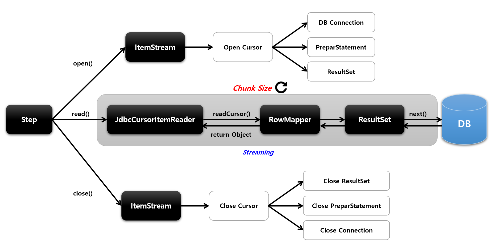
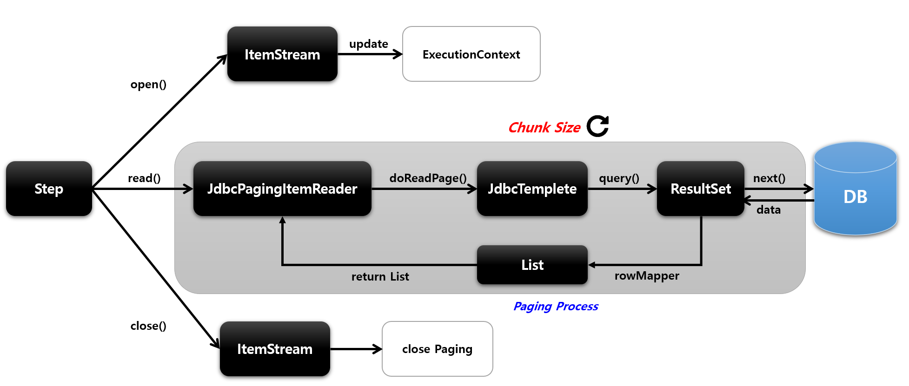
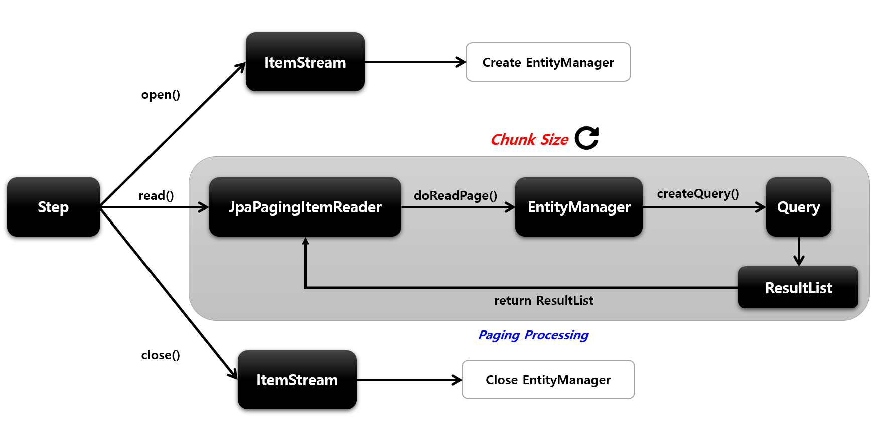

# Cursor Based & Paging Based

## 기본개념

- 배치 어플리케이션은 실시간적 처리가 어려운 대용량 데이터를 다루며 이때 DB I/O 의 성능 문제와 메모리 자원이 효율성 문제를 해결할 수 있어야 한다
- 스프링 배치에서는 대용량 데이터 처리를 위한 두 가지 해결방안을 제시하고 있다

## Cursor Based 처리

- JDBC ResultSet 의 기본 메커니즘을 사용
- 현재 행에 커서를 유지하며 다음 데이터를 호출하면 다음 행으로 커서를 이동하며 데이터 반환이 이루어지는 Streaming 방식의 I/O
- ResultSet 이 open 될 때마다 next() 메소드가 호출 되어 Database 의 데이터가 반환되고 객체와 매핑이 이루어진다
- DB Connection 이 연결되면 배치 처리가 완료될 때 까지 데이터를 읽어오기 때문에 DB와 SocketTimeout 을 충분히 큰 값으로 설정 필요
- 모든 결과를 메모리에 할당하기 때문에 메모리 사용량이 많아지는 단점
- Connection 연결 유지 시간과 메모리 공간이 충분하다면 대량의 데이터 처리에 적합할 수 있다 ( fetchSize 조절 )

## Paging Based 처리

- 페이징 단위로 데이터를 조회하는 방식으로 Page Size 만큼 한번에 메모리로 가지고 온 다음 한 개씩 읽는다
- 한 페이지를 읽을때마다 Connection을 맺고 끊기 때문에 대량의 데이터를 처리하더라도 SocketTimeout 예외가 거의 일어나지 않음
- 시작 행 번호를 지정하고 페이지에 반환시키고자 하는 행의 수를 지정한 후 사용 - Offset, Limit
- 페이징 단위의 결과만 메모리에 할당하기 때문에 메모리 사용량이 적어지는 장점이 있다
- Connection 연결 유지 시간이 길지 않고 메모리 공간을 효율적으로 사용해야 하는 데이터 처리에 적합할 수 있다


## JdbcCursorItemReader

- Cursor 기반의 JDBC 구현체로서 ResultSet 과 함께 사용되며 Datasource 에서 Connection 을 얻어와서 SQL 을 실행한다
- Thread 안정성을 보장하지 않기 때문에 멀티 스레드 환경에서 사용할 경우 `동시성 이슈`가 발생하지 않도록 별도 동기화 처리가 필요

```java
import org.springframework.batch.item.database.JdbcCursorItemReader;
import org.springframework.batch.item.database.builder.JdbcCursorItemReaderBuilder;

public JdbcCursorItemReader itemReader() {
    return new JdbcCursorItemReaderBuilder<>()
            .name("cursorItemReader")           
            .fetchSize(int chunkSize)           // Cursor 방식으로 데이터를 가지고 올 때 한번에 메모리에 할당할 크기를 설정
            .dataSource(DataSource)             // DB에 접근하기 위해 Datasource 설정
            .rowMapper(RowMapper)               // 쿼리 결과로 반환되는 데이터와 객체를 매핑하기 위한 RowMapper 설정
            .beanRowMapper(Class<T>)            // 별도의 RowMapper 을 설정하지 않고 클래스 타입을 설정하면 자동으로 객체와 매핑
            .sql(String Sql)                    // ItemReader 가 조회 할 때 사용할 쿼리 문장 설정
            .queryArguments(Object... args)     // 쿼리 파라미터 설정
            .maxItemCount(int count)            // 조회 할 최대 Item 수
            .currentItemCount(int count)        // 조회 Item 의 시작 지점
            .maxRows(int maxRows)               // ResultSet 오브젝트가 포함 할 수 있는 최대 행 수 
            .build()
}

```




## JpaCursorItemReader

- **Spring Batch 4.3** 버전부터 지원
- Cursor 기반의 JPA 구현체로서 EntityManagerFactory 객체가 필요하며 쿼리는 JPQL 을 사용

```java
public JpaCursorItemReader itemReader() {
     new JpaCursorItemReaderBuilder<T>()
	.name("cursorItemReader")                       
 	.queryString(String JPQL)                           // ItemReader 가 조회 할 때 사용할 JPQL 문장 설정
	.EntityManagerFactory(EntityManagerFactory)         // JPQL 을 실행하는 EntityManager 를 생성하는 팩토리
	.parameterValue(Map<String, Object> parameters)     // 쿼리 파라미터 설정
	.maxItemCount(int count)                            // 조회 할 최대 Item 수
	.currentItemCount(int count)                        // 조회 Item의 시작 지점
	.build();
    }

```


## JdbcPagingItemReader

- Paging 기반의 JDBC 구현체로서 쿼리에 시작 행 번호(offset) 와 페이지에서 반환 할 행 수(limit)를 지정해서 SQL 을 실행
- 스프링 배치에서 offset 과 limit 를 PageSize 에 맞게 자동으로 생성해 주며 페이징 단위로 데이터를 조회할 때 마다 새로운 쿼리가 실행
- 페이지마다 새로운 쿼리를 실행하기 때문에 페이징 시 결과 데이터의 순서가 보장될 수 있도록 order by 구문이 작성되도록 한다
- `멀티 스레드 환경에서 Thread 안정성을 보장`하기 때문에 별도의 동기화를 할 필요가 없다

### PagingQueryProvider

- 쿼리 실행에 필요한 쿼리문을 ItemReader 에게 제공하는 클래스
- 데이터베이스마다 페이징 전략이 다르기 때문에 각 데이터 베이스 유형마다 다른 PagingQueryProvider 를 사용
- **select 절**, **from 절**, **sortKey** 는 `필수`로 설정해야 하며 where, group by 절은 필수가 아님

```java
public JdbcPagingItemReader itemReader() {
    return new JdbcPagingItemReaderBuilder<T>()
	.name("pagingItemReader")
 	.pageSize(int pageSize)		
	.dataSource(DataSource)
	.queryProvider(PagingQueryProvider)             // DB 페이징 전략에 따른 PagingQueryProvider 설정
	.rowMapper(Class<T>)
            
	//PagingQueryProvider API
            .selectClause(String selectClause)
	.fromClause(String fromClause)
	.whereClause(String whereClause)
	.groupClause(String groupClause)
	.sortKeys(Map<String, Order> sortKeys)          // 정렬을 위한 유니크한 키 설정
            
	.parameterValues(Map<String, Object> parameters)
	.maxItemCount(int count)
	.currentItemCount(int count)
	.maxRows(int maxRows)
	.build();
    }
```


## JpaPagingItemReader

- Paging 기반의 JPA 구현체로서 EntityManagerFactory 객체가 필요하며 쿼리는 JPQL 을 사용한다


