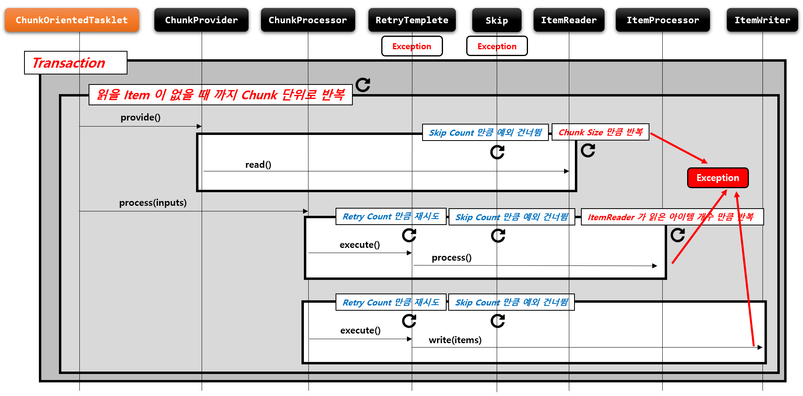
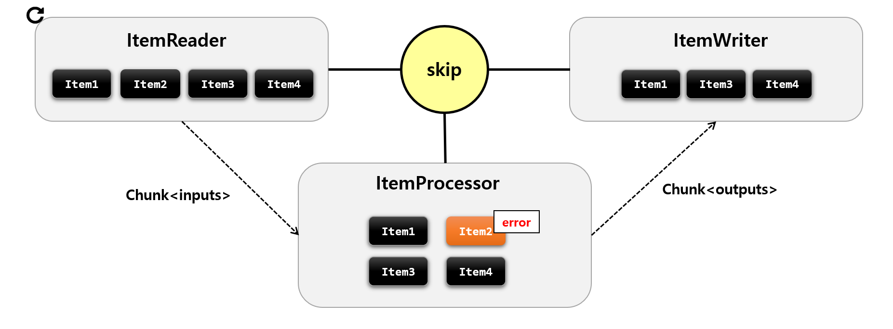
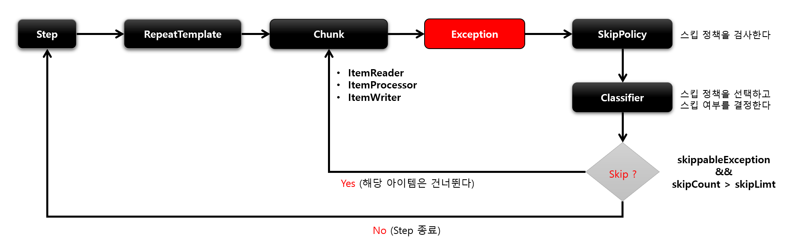
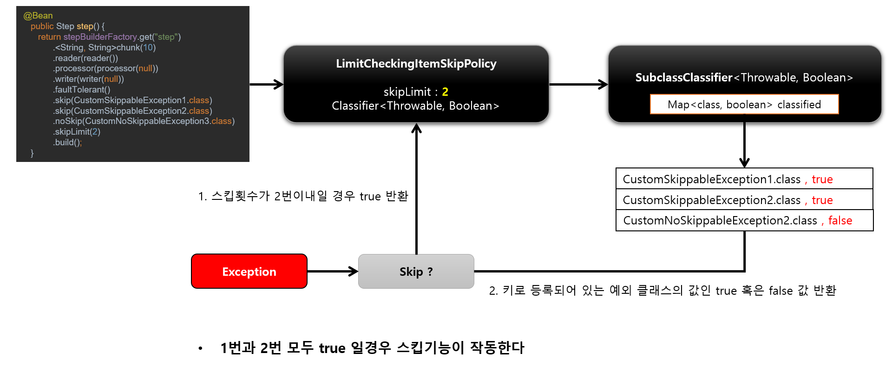
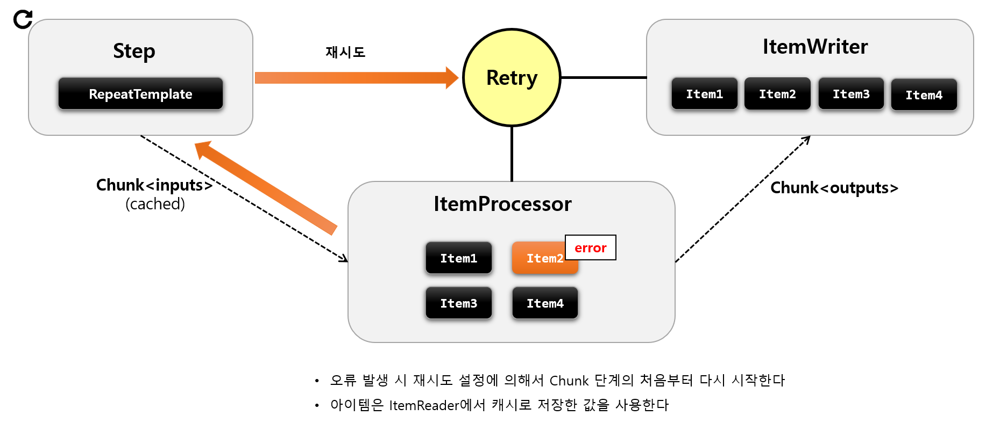
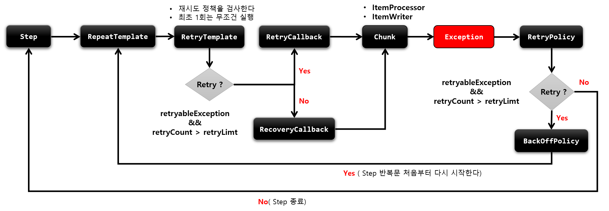

### 기본개념

- 스프링 배치는 Job 실행 중에 오류가 발생할 경우 장애를 처리하기 위한 기능을 제공하며 이를 통해 복원력을 향상시킬 수 있다
- 오류가 발생해도 Step 이 즉시 종료되지 않고 Retry 혹은 Skip 기능을 활성화 함으로써 내결함성 서비스가 가능하도록 한다
- 프로그램의 내 결함성을 위해 Skip 과 Retry 기능을 제공한다
  - **Skip**
    - `ItemReader` / `ItemProcessor` / `ItemWriter` 에 적용 할 수 있다
  - **Retry**
    - `ItemProcessor` / `ItemWriter` 에 적용 할 수 있다
  - FaultTolerant 구조는 청크 기반의 프로세스 기반위에 Skip 과 Retry 기능이 추가되어 재정의 되어 있다

```java
public Step batchStep() {
     return new stepBuilderFactory.get("batchStep")
         .<I, O>chunk(10)
         .reader(ItemReader)
         .writer(ItemWriter)
             
         .falutTolerant()                               // 내결함성 기능 활성화
             
         //skip         
         .skip(Class<? extends Throwable> type)         // 예외 발생 시 Skip 할 예외 타입 설정
         .skipLimit(int skipLimit)                      // Skip 제한 횟수 설정
         .skipPolicy(SkipPolicy skipPolicy)             // Skip 을 어떤 조건과 기준으로 적용 할 것인지 정책 설정
         .noSkip(Class<? extends Throwable> type)       // 예외 발생 시 Skip 하지 않을 예외 타입 설정
    
          //retry
         .retry(Class<? extends Throwable> type)        // 예외 발생 시 Retry 할 예외 타입 설정
         .retryLimit(int retryLimit)                    // Retry 제한 횟수 설정
         .retryPolicy(RetryPolicy retryPolicy)          // Retry 를 어떤 조건과 기준으로 적용 할 것인지 정책 설정
         .backOffPolicy(BackOffPolicy backOffPolicy)    // 다시 Retry 하기 까지의 지연시간(단위:ms)을 설정
         .noRetry(Class<? extends Throwable> type)      // 예외 발생 시 Retry 하지 않을 예외 타입 설정
         .noRollback(Class<? extends Throwable> type)   // 예외 발생 시 Rollback 하지 않을 예외 타입 설정
         .build();
    }
```



## Skip

- Skip은 데이터를 처리하는 동안 설정된 Exception 이 발생했을 경우, 해당 데이터 처리를 건너뛰는 기능이다
- 데이터의 사소한 오류에 대해 Step 의 실패처리 대신 Skip 을 함으로써, 배치수행의 빈번한 실패를 줄일 수 있게 한다



- Skip 기능은 내부적으로 SkipPolicy 를 통해서 구현되어 있다
- Skip 가능 여부를 판별하는 기준
  1. 스킵 대상에 포함된 예외인지 여부
  2. 스킵 카운터를 초과 했는지 여부





```java
public Step batchStep() {
    return stepBuilderFactory.get("batchStep")
  .<I, O>chunk(10)
  .reader(ItemReader)
  .writer(ItemWriter)
  .falutTolerant()
  .skip(Class<? extends Throwable> type) // 예외 발생 시 Skip 할 예외 타입 설정
  .skipLimit(int skipLimit)              // Skip 제한 횟수 설정, ItemReader, ItemProcessor, ItemWriter 횟수 합
  .skipPolicy(SkipPolicy skipPolicy)     // Skip 을 어떤 조건과 기준으로 적용 할 것인지 정책 설정
  .noSkip(Class<? extends Throwable> type)  // 예외 발생 시 Skip 하지 않을 예외 타입 설정
  .build();
}
```

## Retry

- Retry 는 ItemProcessor, ItemWriter 에서 설정된 Exception 이 발생했을 경우, 지정한 정책에 따라 데이터 처리르 재시도하는 기능
- Skip 과 마찬가지로 Retry 를 함으로써, 배치수행의 빈번한 실패를 줄일 수 있게 한다



- Retry 기능은 내부적으로 RetryPolicy 를 통해서 구현되어 있다
- Retry 가능 여부를 판별하는 기준
  1. 재시도 대상에 포함된 예외인지 여부
  2. 재시도 카운터를 초과 했는지 여부




```java
public Step batchStep() {
return stepBuilderFactory.get("batchStep")
  .<I, O>chunk(10)
  .reader(ItemReader)
  .writer(ItemWriter)
  .falutTolerant()
  .retry(Class<? extends Throwable> type)       // 예외 발생 시 Retry 할 예외 타입 설정       
  .retryLimit(int retryLimit)                   // Retry 제한 횟수 설정
  .retryPolicy(SkipPolicy retryPolicy)          // Retry 를 어떤 조건과 기준으로 적용 할 것인지 정책 설정
  .noRetry(Class<? extends Throwable> type)     // 예외 발생 시 Retry 하지 않을 예외 타입 설정
  .backOffPolicy(BackOffPolicy backOffPolicy)   // 다시 Retry 하기 까지의 지연시간 (단위:ms)을 설정
  .noRollback(Class<? extends Throwable> type)  // 예외 발생 시 Rollback 하지 않을 예외 타입 설정
.build();
}
```