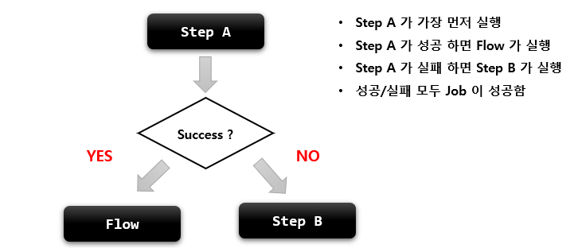

## 기본개념

- Step 을 순차적으로만 구성하는 것이 아닌 특정한 상태에 따라 흐름을 전환하도록 구성할 수 있으며 FlowJobBuilder 에 의해 생성
  - Step 이 실패 하더라도 job 은 실패로 끝나지 않도록 해야 하는 경우
  - Step 이 성공 했을 때 다음에 실행해야 할 Step 을 구분해서 실행 해야 하는 경우
  - 특정 Step 은 전혀 실행되지 않게 구성 해야 하는 경우
- Flow 와 Job 의 흐름을 구성하는데만 관여하고 실제 비즈니스 로직은 Step 에서 이루어짐
- 내부적으로 SimpleFlow 객체를 포함하고 있으며 Job  실행 시 호출



````java
public Job batchJob() {
        return jobBuilderFactory.get("batchJob")    
	.start(Step)                                    // Flow 시작하는 Step
	.on(String pattern)                             // ExitStatus 를 캐치하여 매칭하는 패턴
	.to(Step)                                       // 다음으로 이동할 Step 지정
	.stop() / fail() / end() / stopAndRestart()	    // Flow 를 중지 / 실패 / 종료
	.from(Step)                                     // 이전 단계에서 정의한 Step 의 Flow를 추가 정의
    .next(Step)                                     // 다음으로 이동할 Step
	.end()                                          // build() 앞에 위치하면 SimpleFlow 객체 생성
	.build()    
}
````

# Transition

## 기본개념

- Flow 내 Step 의 조건부 전환을 정의
- Job 의 API 설정에서 on() 메소드를 호출하면 TransitionBuilder 가 반환되어 Transition Flow 를 구성할 수 있음
- Step 의 종료상태(ExitStatus) 가 어떤 pattern 과도 매칭되지 않으면 스프링 배치에서 예외를 발생하고 Job 은 실패
- transition 은 구체적인 것부터 그렇지 않은 순서로 적용

## API

- on
  - Step 의 실행 결과로 돌려받은 종료상태(**ExitStatus**) 와 매칭하는 패턴 스키마, **BatchStatus X**
  - pattern 과 ExitStatus 와 매칭이 되면 다음으로 실행할 Step 을 지정 할 수 있음
  - 특수문자는 두 가지만 허용
    - "*" : 0개 이상의 문자와 매칭, 모든 ExitStatus 와 매칭
    - "?" : 정확히 1개의 문자와 매칭
    - ex : "c*t" 는 "cat", "count" 와 매칭되며, "c?t" 는 "cat" 에만 매칭

- to()
  - 다음으로 실행할 단계를 지정

- from()
  - 이전 단계에서 정의한 Transition 을 새롭게 추가 정의

## Job 을 중단 및 종료 하는 API

> Flow 가 실행되면 FlowExecutionStatus 에 상태값이 저장되고 최종적으로 Job 의 BatchStatus 와 ExitStatus 에 반영

> Step 의 BatchStatus 및 ExitStatus 에는 아무런 영향을 주지 않고 Job 의 상태만을 변경

- stop() 
  - FlowExecutionStatus 가 **STOPPED** 상태로 종료되는 transition
  - Job 의 BatchStatus 와 ExitStatus 가 **STOPPED** 으로 종료됨
- fail()
  - FlowExecutionStatus 가 **FAILED** 상태로 종료되는 transition
  - Job 의 BatchStatus 와 ExitStatus 가 **FAILED** 로 종료됨
- end()
  - FlowExecutionStatus 가 **COMPLETED** 상태로 종료되는 transition
  - Job 의 BatchStatus 와 ExitStatus 가 **COMPLETED** 로 종료됨
  - Step 의 ExitStatus 가 FAILED 이더라도 Job 의 BatchStatus 가 COMPLETED 로 종료하도록 가능하며 이때 Job 의 재시작은 불가능


