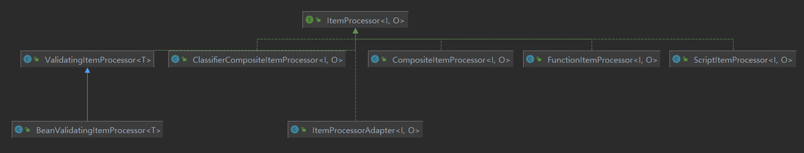
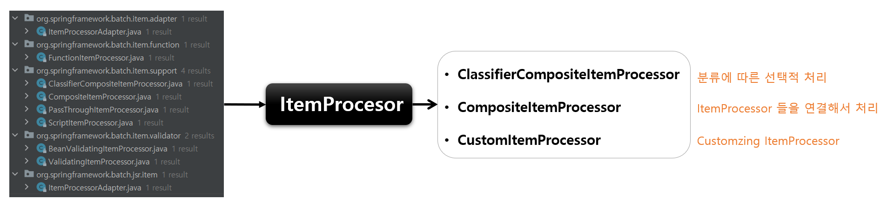
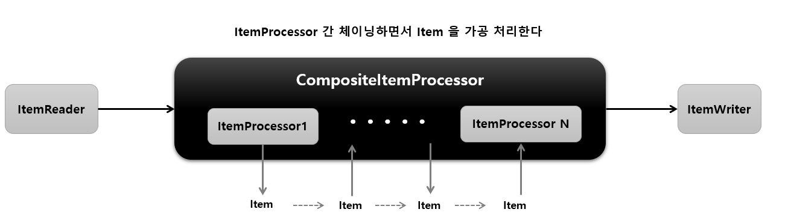
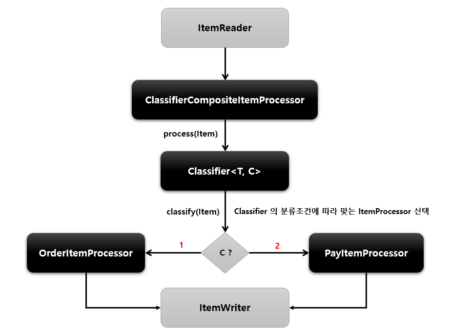

# ItemProcessor

## 기본개념

- 데이터를 출력하기 전에 데이터를 가공, 변형, 필터링하는 역할
- ItemReader 및 ItemWriter 와 분리되어 비즈니스 로직을 구현할 수 있다
- ItemReader 로 부터 받은 아이템을 특정 타입으로 변환해서 ItemWriter 에 넘겨 줄 수 있다
- ItemReader 로 부터 받은 아이템들 중 필터과정을 거쳐 원하는 아이템들만 ItemWriter 에게 넘겨줄 수 있다
  - ItemProcessor 에서 process() 실행결과 null 을 반환하면 Chunk<O> 에 저장되지 않기 때문에 결국 ItemWriter 에 전달되지 않는다
- ChunkOrientedTasklet 실행 시 선택적 요소이기 때문에 청크 기반 프로세싱에서 ItemProcessor 단계가 반드시 필요한 것은 아니다

> 거의 Customizing 해서 사용하기 때문에 기본적으로 제공되는 구현체가 적다

## O process

- <I> 제네릭은 ItemReader 에서 받을 데이터 타입 지정
- <O> 제네릭은 ItemWriter 에게 보낼 데이터 타입 지정
- 아이템 하나씩 가공 처리하며 null 리턴할 경우 해당 아이템은 Chunk<O> 에 저장되지 않음

## CompositeItemProcessor

- ItemProcessor 들을 연결(Chaining) 해서 위임하면 각 ItemProcessor 를 실행시킨다
- 이전 ItemProcessor 반환 값은 다음 ItemProcessor 값으로 연결된다

## ClassifierCompositeItemProcessor

- Classifier 로 라우팅 패턴을 구현해서 ItemProcessor 구현체 중에서 하나를 호출하는 역할을 한다

