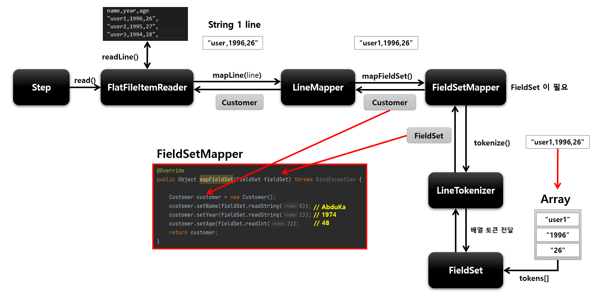

# ItemReader

## 기본개념

- 다양한 입력으로부터 데이터를 읽어서 제공하는 인터페이스
  - 플랫(Flat) 파일 - csv, txt ( 고정 위치로 정의된 데이터 필드나 특수문자로 구별된 데이터의 행 )
  - XML, JSON
  - Database
  - JMS, RabbitMQ 와 같은 MessageQueuing 서비스
  - Custom Reader - 구현 시 멀티 스레드 환경에서 스레드에 안전하게 구현할 필요가 있음
- ChunkOrientedTasklet 실행 시 필수적 요소로 설정해야 한다

## T read()

- 입력 데이터를 읽고 다음 데이터로 이동
- 아이템 하나를 리턴하며 더 이상 아이템이 없는 경우 null 리턴
- 아이템 하나는 파일의 한줄, DB 의 한 Row 혹은 XML 파일에서 하나의 엘리먼트가 될 수 있다
- 더 이상 처리해야 할 Item 이 없어도 예외가 발생하지 않고 ItemProcessor 와 같은 다음 단계로 넘어 간다


## FlatFileItemReader

- 2차원 데이터(표)로 표현된 유형의 파일을 처리하는 ItemReader
- 일반적으로 고정 위치로 정의된 데이터 필드나 특수 문자에 의해 구별된 데이터의 행을 읽는다
- Resource 와 LineMapper 두가지 요소가 필요하다

### Resource

- FileSystemResource - new FileSystemResource("resource/path/config.xml")
- ClassPathResource - new ClassPathResource("classpath:path/config.xml")

### LineMapper

- 파일의 라인 한줄을 Object 로 변환해서 FlatFileItemReader 로 리턴
- 단순히 문자열을 받기 때문에 문자열을 토큰화해서 객체로 매핑하는 과정이 필요
- LineTokenizer 와 FieldSetMapper 를 사용해서 처리

- FieldSet
  - 라인을 필드로 구분해서 만든 배열 토큰을 전달하면 토큰 필드를 참조 할 수 있도록 한다
  - JDBC 의 ResultSet 과 유사
- LineTokenizer
  - 입력받은 라인을 FieldSet 으로 변환해서 리턴
  - 파일마다 형식이 다르기 때문에 문자열을 FieldSet 으로 변환하는 작업을 추상화시켜야 한다
- FieldSetMapper
  - FieldSet 객체를 받아서 원하는 객체로 매핑해서 리턴
  - JdbcTemplate 의 RowMapper 와 동일한 패턴을 사용

```java
public FlatFileItemReader itemReader() {
    return new FlatFileItemReaderBuilder<T>()
      .name(String name)                    // 이름 설정, ExecutionContext 내에서 구분하기 위한 Key로 저장
      .resource(Resource)                   // 읽어야할 리소스 설정
      .delimited().delimiter("|")           // 파일의 구분자를 기준으로 파일을 읽어들이는 설정
      .fixedLength()                        // 파일의 고정길이를 기준으로 파일을 읽어드리는 설정
      .addColumns(Range..)                  // 고정길이 범위를 정하는 설정
      .names(String[] fieldNames)           // LineTokenizer 로 구분된 라인의 항목을 객체의 필드명과 매핑하도록 설정
      .targetType(Class class)              // 라인의 각 항목과 매핑할 객체 타입 설정
      .addComment(String Comment)           // 무시할 라인의 코멘트 기호 설정
      .strict(boolean)                      // 라인을 읽거나 토큰화 할 때 Parsing 예외가 발생하지 않도록 검증 생략하도록
      .encoding(String encoding)            // 파일 인코딩 설정
      .linesToSkip(int linesToSkip)         // 파일 상단에 있는 무시할 라인 수 설정
      .saveState(boolean)                   // 상태정보를 저장할 것인지
      .setLineMapper(LineMapper)            // LineMapper 객체 설정
      .setFieldSetMapper(FieldSetMapper)    // FieldSetMapper 객체 설정
      .setLineTokenizer(LineTokenizer)      // LineTokenizer 객체 설정
      .build();
    }
```



## JsonItemReader

- Json 데이터의 Parsing 과 Binding 을 JsonObjectReader 인터페이스 구현체에 위임하여 처리하는 ItemReader
- 두가지 구현체 제공
  - JacksonObjectReader
  - GsonJosnObjectReader
