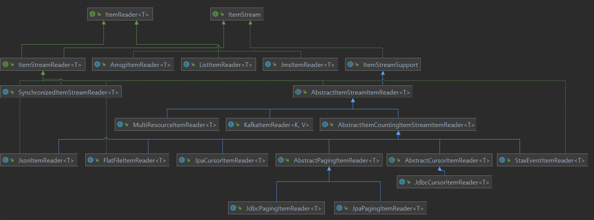
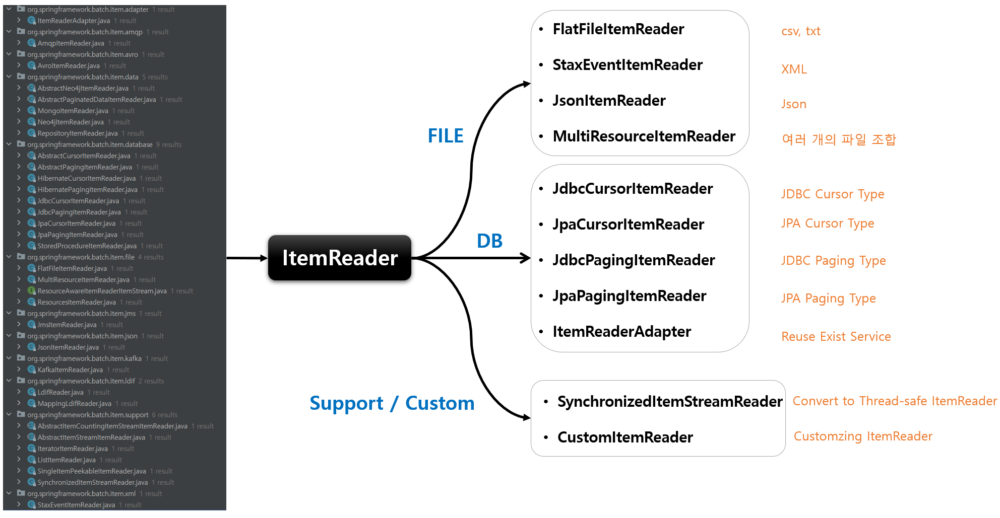

# ItemReader

## 기본개념

- 다양한 입력으로부터 데이터를 읽어서 제공하는 인터페이스
  - 플랫(Flat) 파일 - csv, txt ( 고정 위치로 정의된 데이터 필드나 특수문자로 구별된 데이터의 행 )
  - XML, JSON
  - Database
  - JMS, RabbitMQ 와 같은 MessageQueuing 서비스
  - Custom Reader - 구현 시 멀티 스레드 환경에서 스레드에 안전하게 구현할 필요가 있음
- ChunkOrientedTasklet 실행 시 필수적 요소로 설정해야 한다

## T read()

- 입력 데이터를 읽고 다음 데이터로 이동
- 아이템 하나를 리턴하며 더 이상 아이템이 없는 경우 null 리턴
- 아이템 하나는 파일의 한줄, DB 의 한 Row 혹은 XML 파일에서 하나의 엘리먼트가 될 수 있다
- 더 이상 처리해야 할 Item 이 없어도 예외가 발생하지 않고 ItemProcessor 와 같은 다음 단계로 넘어 간다

