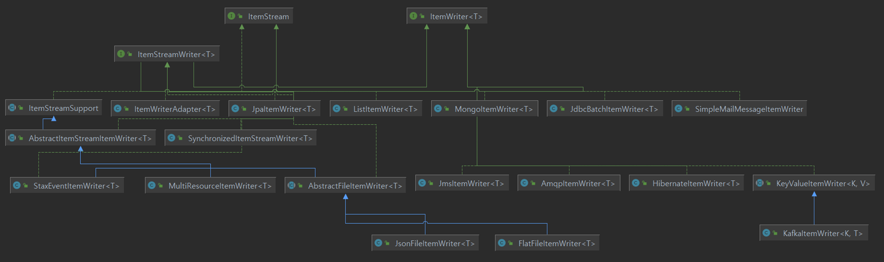

# ItemWriter

## 기본개념

- Chunk 단위로 데이터를 받아 일괄 출력 작업을 위한 인터페이스
  - 플랫(Flat) 파일 - csv, txt
  - XML, JSON
  - Database
  - JMS, RabbitMQ 와 같은 Message Queuing 서비스
  - Mail Service
  - Custom Writer
- 아이템 하나가 아닌 아이템 리스트를 전달 받는다
- ChunkOrientedTasklet 실행 시 필수적 요소로 설정해야 한다

## void write(List<? extend T> items)

- 출력 데이터를 아이템 리스트로 받아 처리한다
- 출력이 완료되고 트랜잭션이 종료되면 새로운 Chunk 단위 프로세스로 이동한다





# FlatFileItemWriter

- 2차원 데이터(표)로 표현된 유형의 파일을 처리하는 ItemWriter
- 고정 위치로 정의된 데이터 필드나 특수 문자에 의해 구별된 데이터의 행을 기록
- Resource 와 LineAggregator 두 가지 요소가 필요

## LineAggregator

- Item 을 받아서 String 으로 변환하여 리턴
- FieldExtractor 를 사용해서 처리할 수 있다
- 구현체
  - PassThroughLineAggregator, DelimitedLineAggregator, FormatterLineAggregator

## FieldExtractor

- 전달 받은 Item 객체의 필드를 배열로 만들고 배열을 합쳐서 문자열을 만들도록 구현하도록 제공하는 인터페이스
- 구현체
  - BeanWrapperFieldExtractor, PassThroughFieldExtractor


```java
public FlatFileItemReader itemReader() {
    return new FlatFileItemWriterBuilder<T>()
      .name(String name)
      .resource(Resource)                       // 쓰기할 리소스 설정
      .lineAggregator(LineAggregator<T>)        // 객체를 String 으로 변환하는 LineAggregator 객체 설정
      .append(boolean)                          // 존재하는 파일에 내용을 추가할 것인지 여부 설정
      .fieldExtractor(FieldExtractor<T>)        // 객체 필드를 추출해서 배열로 만드는 FieldExtractor 설정
      .headerCallback(FlatFileHeaderCallback)   // 헤더를 파일에 쓰기위한 콜백 인터페이스
      .footerCallback(FlatFileFooterCallback)   // 푸터를 파일에 쓰기위한 콜백 인터페이스
      .shouldDeleteIfExists(boolean)            // 파일이 이미 존재한다면 삭제
      .shouldDeleteIfEmpty(boolean)             // 파일의 내용이 비어 있다면 삭제
      .delimited().delimiter(String delimiter)  // 파일의 구분자를 기준으로 파일을 작성하도록 설정
      .formatted().format(String format)        // 파일의 고정길이를 기준으로 파일을 작성하도록 설정
      .build();
    }
```

# JsonFileItemWriter

- 객체를 받아 Json String 으로 변환하는 역할을 한다

```java
public JsonFileItemWriterBuilder  itemReader() {
    return JsonFileItemWriterBuilder <T>()
      .name(String name)
      .resource(Resource)	
      .append(boolean)
      .jsonObjectMarshaller(JsonObjectMarshaller)       // JsonObjectMarshaller 객체 설정
      .headerCallback(FlatFileHeaderCallback)           // 헤더를 파일에 쓰기위한 콜백 인터페이스
      .footerCallback(FlatFileFooterCallback)           // 푸터를 파일에 쓰기위한 콜백 인터페이스
      .shouldDeleteIfExists(boolean)                    
      .shouldDeleteIfEmpty(boolean)
    .build();
}
```


# JdbcBatchItemWriter

- JdbcCursorItemReader 설정과 마찬가지로 datasource 를 지정하고, Sql 속성에 실행할 쿼리를 설정
- JDBC 의 Batch 기능을 사용하여 bulk insert/update/delete 방식으로 처리
- 단건 처리가 아닌 일괄처리이기 때문에 성능에 이점을 가진다

```java
public JdbcBatchItemWriter itemWriter() {
    return new JdbcBatchItemWriterBuilder<T>()
      .name(String name)
      .datasource(Datasource)
      .sql(String sql)
      .assertUpdates(boolean)       // 트랜잭션 이후 적어도 하나의 항목이 행을 업데이트 혹은 삭제하지 않을 경우 예외발생여부를 설정함, 기본값 true
      .beanMapped()                 // Pojo 기반으로 Insert SQL 의 Value 를 맵핑
      .columnMapped()               // Key, Value 기반으로 Insert SQL 의 Values 를 맵핑
      .build();
}
```


# JpaItemWriter

- JPA Entity 기반으로 데이터를 처리하며 EntityManagerFactory 를 주입받아 사용
- Entity 를 하나씩 chunk 크기 만큼 insert 혹은 merge 한 다음 flush 한다
- ItemReader 나 ItemProcessor 로부터 아이템을 전달 받을 때는 Entity 클래스 타입으로 받아야 한다
```java
public JpaItemWriter itemWriter() {
    return new JpaItemWriterBuilder<T>()
      .usePersist(boolean)				            // Entity 를 persist() 할 것인지 여부 설정, false 이면 merge() 처리
      .entityManagerFactory(EntityManagerFactory)
      .build();
}
```

