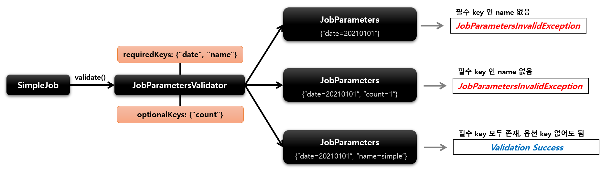

### 기본개념

- SimpleJob 은 Step 을 실행시키는 Job 구현체로서 SimpleJobBuilder 에 의해 생성
- 여러 단계의 Step 으로 구성할 수 있으며 Step 을 순차적으로 실행시킨다
- 모든 Step 의 실행이 성공적으로 완료되어야 Job 이 성공적으로 완료
- 맨 마지막에 실행한 Step 의 BatchStatus 가 Job 의 최종 BatchStatus 가 된다

>JobBuilderFactory > Jobbuilder > SimpleJobBuilder > SimpleJob

```java
public Job batchJob() {
    return jobBuilderFactory.get("batchJob")        // JobBuilder 를 생성,
            .start(Step)                            // 처음 실행 할 Step, 최초 한번 설정, SimpleJobBuilder 반환
            .next(Step)                             // 다음에 실행 할 Step, 횟수는 제한 없음
            .incrementer(JobParametersIncrementer)  // JobParameter 의 값을 자동으로 증가
            .preventRestart(true)                   // Job 의 재시작 가능 여부 설정, default : true ( job을 실패해도 재시작 불가 )
            .validator(JobParametersValidator)      // JobParameter를 실행하기 전에 검증
            .listener(JobExecutionListener)         // Job 라이프 사이클의 특정 시점에 콜백 제공 받도록 리스너 설정
            .build();                               // SimpleJob 생성
}
```

## validator

### 기본개념

- Job 실행에 꼭 필요한 파라미터를 검증하는 용도
- **DefaultJobParametersValidator** 구현체를 지원하며, 인터페이스를 직접 구현할 수 있음

