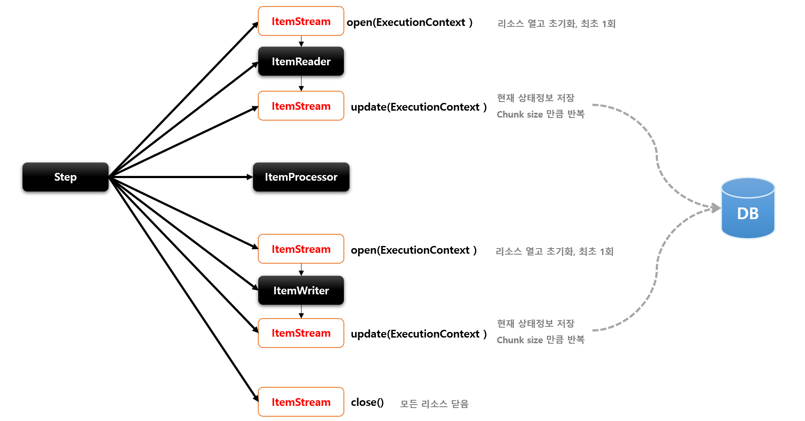

# ItemStream

## 기본개념

- ItemReader 와 ItemWriter 처리 과정 중 상태를 저장하고 오류가 발생하면 해당 상태를 참조하여 실패한 곳에서 재 시작 하도록 지원
- 리소스를 열고 닫아야 하며 입출력 장치 초기화 등의 작업을 해야 하는 이유
- ExecutionContext 를 매개변수로 받아서 사애 정보를 업데이트 한다
- ItemReader 및 ItemWriter 는 ItemStream 을 구현해야 한다

