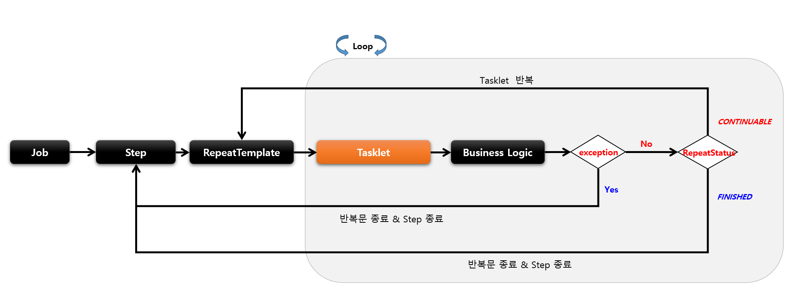
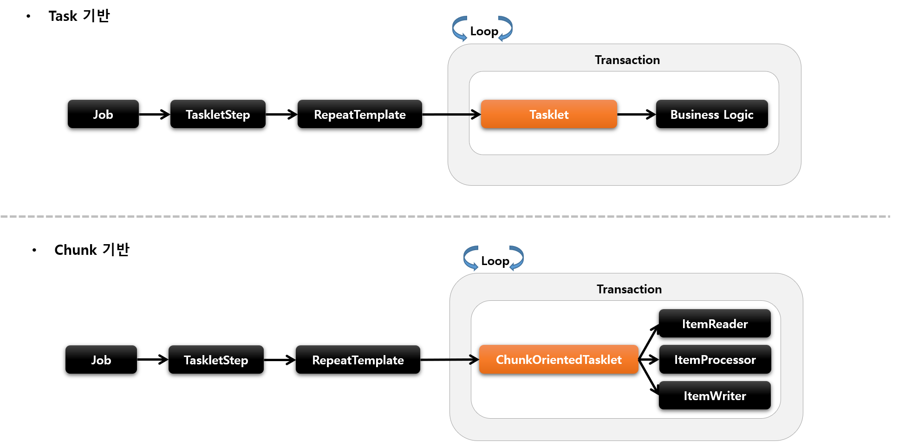
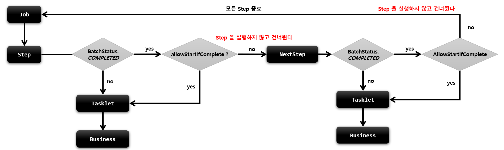

## 기본개념

- 스프링 배치에서 제공하는 Step 의 구현체로서 tasklet 을 실행시키는 도메인 객체
- RepeatTemplate 를 사용해서 Tasklet 의 구문을 트랜잭션 경계 내에서 반복 실행
- Task 기반과 Chunk 기반으로 나누어서 Tasklet 을 실행



## Task vs Chunk

- 스프링 배치에서 Step의 실행 단위는 크게 2가지로 나누어짐
  - **chunk 기반**
    - 하나의 큰 덩어리를 n개씩 나눠서 실행한다는 의미로 대량 처리를 하는 경우 효과적으로 설계
    - **ItemReader**, **ItemProcessor**, **ItemWriter** 를 사용하며 청크 기반 전용 Tasklet 인 **ChunkOrientedTasklet** 구현체가 제공된다
  

  - **Task 기반**
    - ItemReader 와 ItemWriter 와 같은 청크 기반의 작업 보다 **단일 작업 기반으로 처리되는 것이 더 효율**적인 경우
    - 주로 Tasklet 구현체를 만들어 사용
    - 대량 처리를 하는 경우 chunk 기반에 비해 더 복잡한 구현 필요
  
 
  
  

# Tasklet

## 기본개념

- Tasklet
  - Step 내에서 구성되고 실행되는 도메인 객체로 단일 테스크를 수행하기 위한 것
  - TaskletStep 에 의해 반복적으로 수행되며 반환값에 따라 계속 수행 혹은 종료
  - RepeatStatus - Tasklet 의 반복 여부 상태 값
    - **RepeatStatus.FINISHED** - Tasklet 종료, RepeatStatus 을 null 로 반환하면 FINISHED 로 해석됨
    - **RepeatStatus.CONTINUABLE** - Tasklet 반복
    - FINISHED 가 리턴되거나 실패 예외가 던져지기 전까지 TaskletStep 에 의해 while 문 안에서 반복적으로 호출 됨 ( 무한루프 주의 )
  - 익명 클래스 혹은 구현 클래스를 사용
  - Step 에 오직 하나의 Tasklet 설정이 가능하며 두개 이상을 설정 했을 경우 마지막에 설정한 객체가 실행 됨


# allowStartIfComplete()

## 기본개념

- 재시작 가능한 Job 에서 Step 의 이전 성공 여부와 상관없이 항상 Step 을 실행하기 위한 설정
- 실행 마다 유효성을 검증하는 Step 이나 사전 작업이 꼭 필요한 Step 등에서 활용
- 기본적으로 COMPLETED 상태를 가진 Step 은 Job 재 시작 시 실행하지 않고 스킵
- allow-start-if-complete 가 "true" 로 설정된 Step 은 항상 실행



```java
public Step batchStep() {
        return stepBuilderFactory.get("batchStep")
	    .tasklet(Tasklet)
            .startLimit(10)
            .allowStartIfComplete(true)
            .listener(StepExecutionListener)
            .build();
}
```

