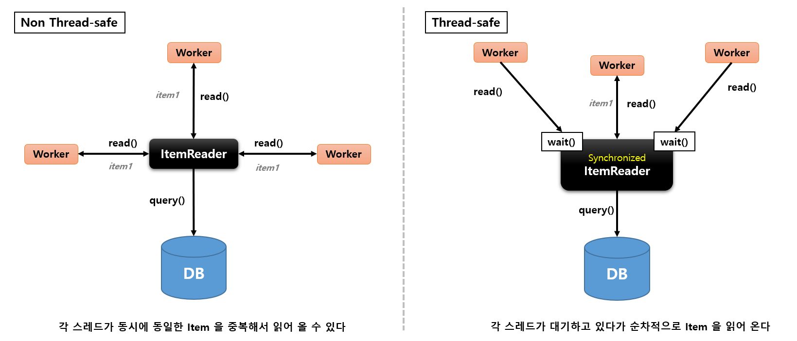

## 단일 스레드 vs 멀티 스레드

- 프로세스 내 특정 작업을 처리하는 스레드가 하나일 경우 단일 스레드, 여러 개 일 경우 멀티 스레드로 정의
- 작업 처리에 있어서 단일스레드와 멀티 스레드의 선택 기준은 어떤 방식이 자원을 효율적으로 사용하고 성능처리에 유리한가 하는 점이다
- 일반적으로 복잡한 처리나 대용량 데이터를 다루는 작업일 경우 전체 소요 시간 및 성능상의 이점을 가져오기 위해 멀티 스레드 방식을 선택
- 멀티 스레드 처리 방식은 데이터 동기화 이슈가 존재 하기 때문에 최대한 고려해서 결정해야 한다


## 스프링 배치 스레드 모델

- 스프링 배치는 기본적으로 단일 스레드 방식으로 작업을 처리한다
- 성능 향상과 대규모 데이터 작업을 위한 비동기 처리 및 Scale out 기능을 제공한다

### AsyncItemProcessor / AsyncItemWriter

- ItemProcessor 에게 별도의 스레드가 할당되어 작업을 처리하는 방식

### Multi-threaded Step

- Step 내 Chunk 구조인 ItemRader, ItemProcessor, ItemWriter 마다 여러 스레드가 할당되어 실행 하는 방법

### Remote Chunking

- 분산환경처럼 Step 처리가 여러 프로세스로 분할되어 외부의 다른 서버로 전송되어 처리하는 방식

### Parallel Steps

- Step 마다 스레드가 할당되어 여러개의 Step 을 병렬로 실행하는 방법

### Partitioning

- Master/slave 방식으로 Master 가 데이터를 파티셔닝 한 다음 각 파티션에게 스레드를 할당하여 Slave 가 독립적으로 작동하는 방식


## AsyncItemProcessor / AsyncItemWriter

- Step 안에서 ItemProcessor 가 비동기적으로 동작하는 구조
- `AsyncItemProcessor` 와 `AsyncItemWriter` 가 함께 구성이 되어야 함
- AsyncItemProcessor 로부터 AsyncItemWriter 가 받는 최종 결과값은 List<Future<T>> 타입이며 비동기 실행이 완료될 때까지 대기한다
- spring-batch-integration 의존성 필요


```java
public Step step() throws Exception {
    return stepBuilderFactory.get("step")
            .chunk(100)
            .reader(pagingItemReader())         // ItemReader 설정 : 비동기 실행 아님
            .processor(asyncItemProcessor())    // 스레드 풀 개수 만큼 스레드가 생성되어 비동기로 실행된다
            .writer(asyncItemWriter())          // 비동기 실행 결과 값들을 모두 받아오기까지 대기함
            .taskExecutor(taskExecutor())
            .build();
}

@Bean
public TaskExecutor taskExecutor(){
  ThreadPoolTaskExecutor executor = new ThreadPoolTaskExecutor();
  executor.setCorePoolSize(4);
  executor.setMaxPoolSize(8);
  executor.setThreadNamePrefix("async-thread-");
  return executor;
}
```

## Multi-Threaded-Step

- Step 내에서 스레드로 Chunk 기반 처리가 이루어지는 구조
- TaskExecutorRepeatTemplate 이 반복자로 사용되며 설정한 개수 (ThrottleLimit) 만큼의 스레드를 생성하여 수행한다


- ItemReader 는 Thread-safe 인지 반드시 확인해야 한다
  - 데이터를 소스로 부터 읽어오는 역할이기 때문에 스레드마다 중복해서 데이터를 읽어오지 않도록 동기화가 보장되어야 함
- 스레드마다 새로운 chunk 가 할당되어 데이터 동기화가 보장된다
  - 스레드끼리 chunk 를 서로 공유하지 않는다
  - chunk를 공유하지 않지만 스레드가 접근하는 reader, processor, wirter 는 같음.


## Parallel Steps

- SplitState 를 사용해서 여러 개의 Flow 들을 병렬적으로 실행하는 구조
- 실행이 다 완료된 후 FlowExecutionStatus 결과들을 취합해서 다음 단계 결정을 한다


## Partitioning

- MasterStep 이 SlaveStep 을 실행시키는 구조
- SlaveStep 은 각 스레드에 의해 독립적으로 실행이 됨
- SlaveStep 은 독립적인 StepExecution 파라미터 환경을 구성
- SlaveStep 은 ItemReader / ItemProcessor / ItemWriter 등을 가지고 동작하며 작업을 독립적으로 병렬 처리
- MasterStep 은 PartitionStep 이며 SlaveStep 은 TaskletStep, FlowStep 등이 올 수 있다


- 각스레드는 자신에게 할당된 StepExecution 을 가지고 있다
- 각 스레드는 자신에게 할당된 청크 클래스를 참조한다
- `Thread-Safe` 만족


```java
public Step step() throws Exception {
    return stepBuilderFactory.get("masterStep")
            .partitioner("slaveStep", new ColumnRangePartitioner()) // PartitionStep 생성을 PartitionStepBuilder 가 생성되고 Partitioner 를 생성 
            .step(slaveStep())                                      // 슬레이브 역할을 하는 Step 을 설정
            .gridSize(4)                                            // 파티션 구분을 위한 값 설정
            .taskExecutor(ThreadPoolTaskExecutor())                 // 스레드 생성, 스레드 풀 관리
            .build();
}
```

## SynchronizedItemStreamReader

- `Thread-safe 하지 않은` ItemReader 를 Thread-safe 하게 처리하도록 하는 역할
- Spring Batch 4.0 이상 지원




