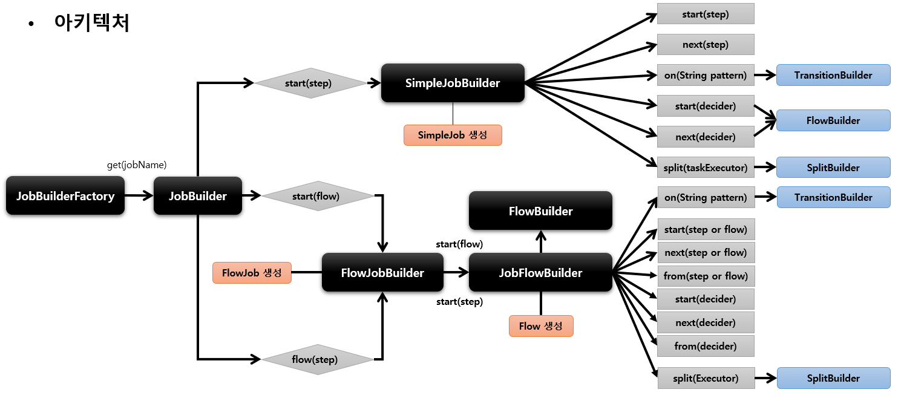
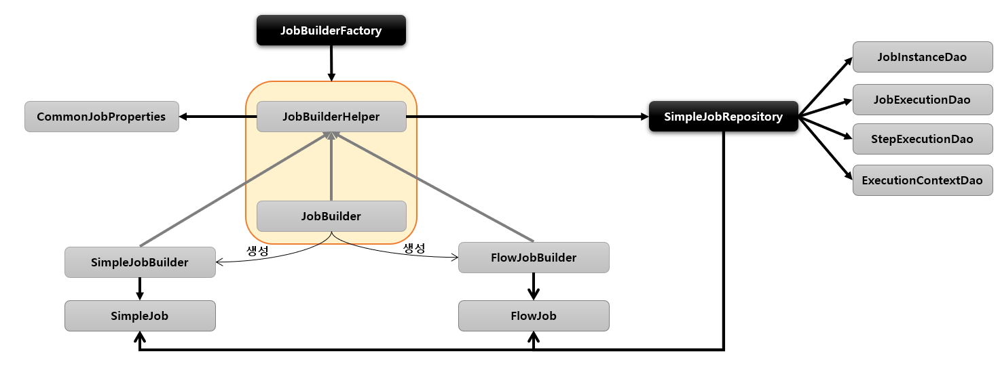

## 배치 초기화 설정

### JobLauncherApplicationRunner
 - Spring Batch 작업을 시작하는 ApplicationRunner 로서 **BatchAutoConfiguration** 에서 생성
 - 스프링 부트에서 제공하는 ApplicationRunner 의 구현체로 어플리케이션이 구동 되자마자 실행
 - 기본적으로 Bean 으로 등록된 모든 Job 을 실행시킨다

### BatchProperties
 - Spring Batch 의 환경 설정 클래스
 - Job 이름, 스키마 초기화 설정, 테이블 Prefix 등의 값을 설정할 수 있음
 - ex :
```yaml
spring:
  batch:
    jdbc:
      tablePrefix: SYSTEM_     #기본 BATCH_
      initialize-schema: NEVER
    job:
      names: ${job.name:NONE}
      enabled: false #job자동실행 방지 - JobRunner Class Test
```

### Job 실행 옵션
 - 지정한 Batch Job 만 실행 하도록 설정 가능
 - 어플리케이션 실행 시 Program arguments 로 Job 이름 입력

```
 --job.name=helloJob
 --job.name=helloJob,simpleJob # 하나 이상의 Job 을 실행 할 경우 쉼표로 구분 
 ```


## JobBuilderFactory
 
 - Job 을 구성하는 설정 조건에 따라 두개의 하위 빌더 클래스를 생성하고 실제 Job 생성을 위임
 - **SimpleJobBuilder** 
   - SimpleJob 을 생성하는 Builder 클래스
   - Job 실행과 관련된 여러 설정 API 를 제공
 - **FlowJobBuilder**
   - FlowJob 을 생성하는 Builder 클래스
   - 내부적으로 FlowBuilder 를 반환하여 Flow 실행과 관련된 여러 설정 API를 제공



### 클래스 상속 구조
